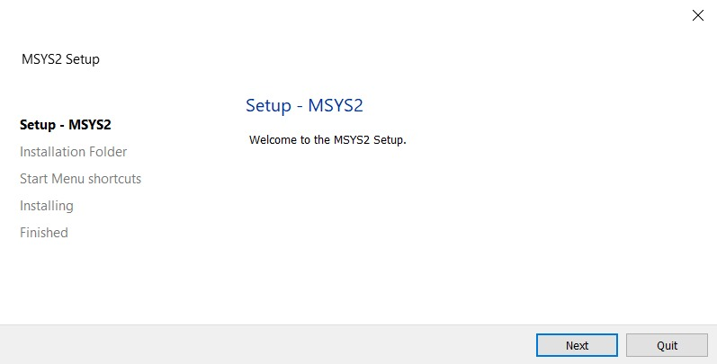
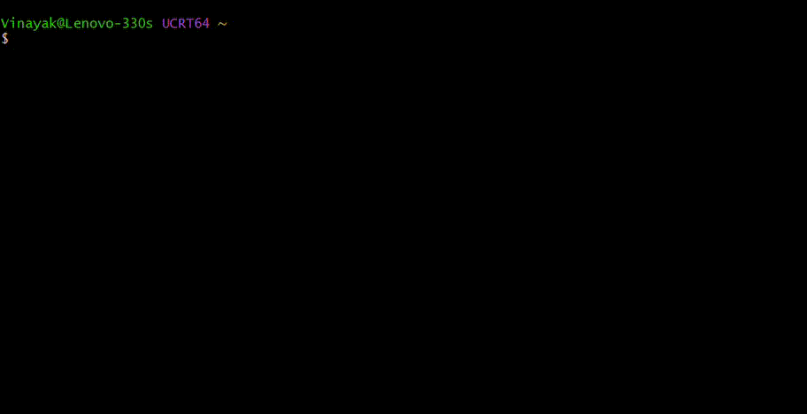
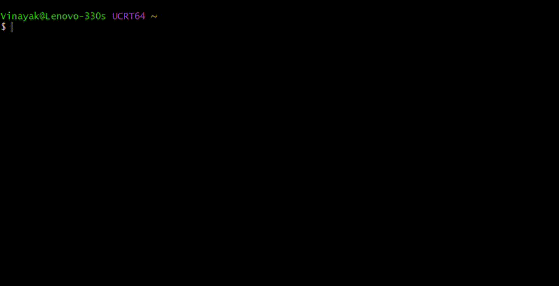
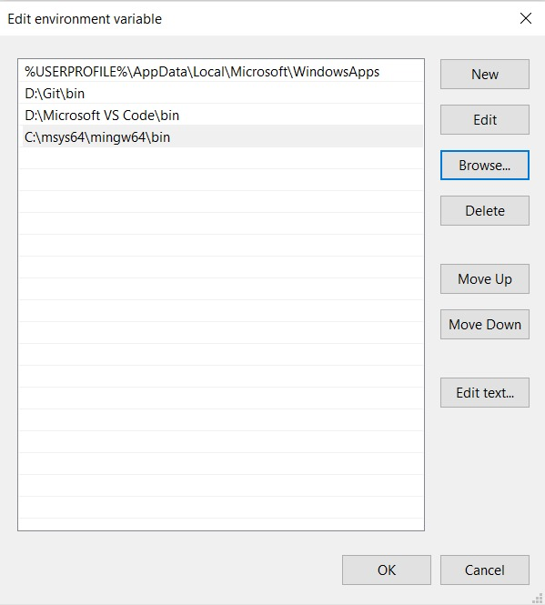
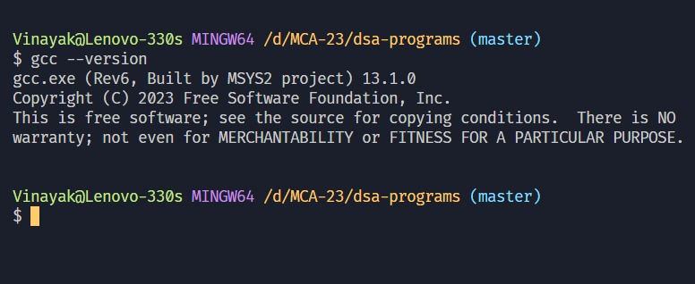
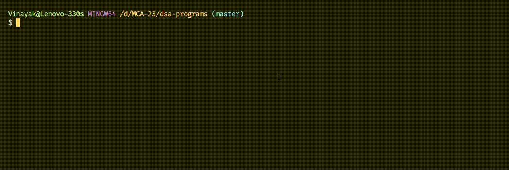
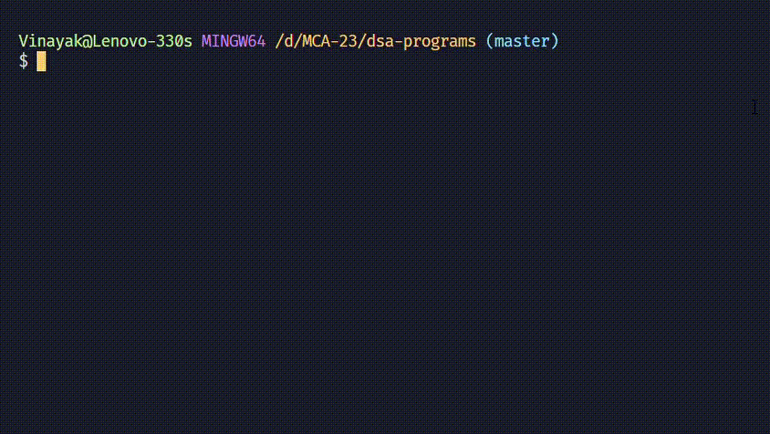
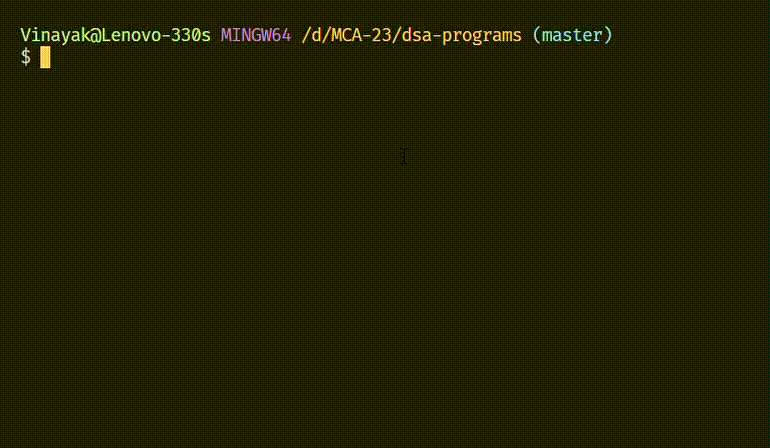

# [USICT](http://www.ipu.ac.in/usict) MCA(SE) Batch: 2023-25

## DSA Lab Programs

### Table of Contents

- [About this Repo.](#about-this-repo)
- [Getting Started](#getting-started)
  - [Setting Up Git](#setting-up-git)
  - [Setting Up Compiler](#setting-up-compiler)
- [Installation](#installation)
- [Usage](#usage)
  - [Compile](#compile)
  - [Execute](#execute)
- [Programs List](#programs-list)

## About This Repo

This repository contains source code of DSA (Professor Dr. Reena Gupta)  lab programs for USICT MCA(SE) Batch 2023-25.

## Getting Started

This section is a walkthrough to setup minimum requirements to run the programs in this repo.

### Setting up Git

Git is a fast, scalable, distributed revision control system with an unusually rich command set that provides both high-level operations and full access to internals.
To check if you have git installed, run the following command in terminal:

``` bash
git --version
```

If you do not have git installed, download and install it from [here](https://git-scm.com/downloads) or follow this [documentation](https://git-scm.com/book/en/v2/Getting-Started-Installing-Git).

### Setting up Compiler

C is a compiled language meaning the source code must be compiled before it can be run.

To check if you have a compiler, run the following command in terminal:

``` bash
gcc --version 
```

If you do not have a compiler, follow these steps:

1. Firstly, install [MSYS2](https://github.com/msys2/msys2-installer/releases/download/2023-05-26/msys2-x86_64-20230526.exe). It will provide the latest builds for mingw-64.

2. Run the installer and follow the steps of the installation wizard.


3. Run these commands in the newly opened MSYS2 shell:
    - `gcc` i.e GNU Compiler Collection contains compiler for many languages such as C, C++, Ada, Go etc. as well as libraries for these languages.

    ``` bash
    pacman -S mingw-w64-x86_64-gcc
    ```

    

    - `gdb` i.e GNU Debugger is a portable debugger which, ofcourse, helps in debugging your code.

    ``` bash
    pacman -S mingw-w64-x86_64-gdb
    ```

    

4. Almost done... don't forget to add the **mingw bin** folder as an environment variable.
In most cases it will be `c:\msys64\mingw64\bin`.


5. Finally, confirm that everything is working properly by running `gcc --version`.


## Installation

The easiest step ever. Just run this command on terminal and you are ready to go:

``` bash
git clone https://github.com/vinayak-vohra/dsa-programs.git
```

## Usage

### Compile

To compile `hello-world.c`, use the following command:

``` bash
gcc hello-world.c -o hello-world
```

Let's quickly understand what is happening here:

1. `gcc` : Compiler command.
2. `hello-world.c`: The file to be compiled.
3. `-o hello-world`: Output file name (default: `a.out`). [see all flags](https://gcc.gnu.org/onlinedocs/gcc/Option-Summary.html)

If there are errors, they will be listed in the terminal. Debug the errors.


If there are no errors in your code, then an executable `.exe` file will be generated by the name you provided or by `a.out` if you were lazy to do so and the control will return to terminal.


### Execute

- If there are some errors, then debug the errors before compiling again because sadly errors don't vanish by themselves.

- Open a new terminal window (that much you should know how to do), and type the output executable file name. If on bash, add `./` before file name.

> Make sure you are in the same folder where file is present.



- Voila~ enjoy the output of your efforts.

## Programs List

1. Implement operations on an `array`:
    - Traverse
    - Insert
    - Delete
    - Linear search
    - Selection sort  

2. Implement operations on a  linked list and circular linked list:
    - Insertion & Deletion
        - at the beginning
        - at the specified location
        - at the end

3. Implement operations on a double linked list and circular double linked list:
    - Insertion & Deletion
        - at the beginning
        - at the specified location
        - at the end

4. Write a program to `count` the number of nodes & `reverse` the single linked list.

5. Implement operations `push` and `pop` on a stack using arrays. Check the status of the stack whether there is underflow or overflow.

6. Implement the `conversion` of infix notation to postfix notation

7. Implement `evaluation` of postfix notation using `stacks`.

8. Implement operations `enqueue` and `dequeue` on a queue using arrays. Check the status of the queue whether it is empty or full.

9. Implement a `circular queue` using arrays and linked list.

10. Implement `stacks` and `queues` using a linked list.

11. Implement `Sparse Array`.

12. Implement operations on `Binary Search Tree`:
    - Insertion
    - Deletion
    - Search
    - Traversals (using recursion)
        - Inorder
        - Preorder
        - Postorder

13. Implement traversals on `Binary Search Tree` (using stacks)
    - Inorder
    - Preorder
    - Postorder

14. Implement `graph traversal`:
    - Depth-first Search (DFS).
    - Breadth-first Search (BFS).

15. Make a menu driven program to perform various `sorting` techniques
    - Insertion sort
    - Merge sort
    - Heap sort
    - Quick sort
    - Counting sort
    - Radix sort
    - Bucket sort

16. Implement `AVL tree`

17. Implement Kruskal’s and Prim’s `Minimum Spanning Tree` algorithms.

18. Make a menu driven program to perform various `shortest path algorithms`- Floyd Warshall, Bellman-Ford, Dijkstra.

19. Write a program to implement `Dynamic Programming Algorithms` - Matrix Chain Multiplication, Longest Common Subsequence.

20. Implement `Huffman Code Algorithm`.
\
[back to table of contents](#table-of-contents)
